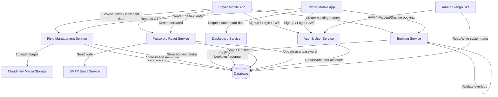

# Field Data Flow Diagram (FDD)

## System Overview

This project is a Django REST API backend for a soccer field booking platform.
The system supports two main user roles:

- `player`: can browse fields, request bookings, and manage their profile.
- `owner`: can create and edit fields, manage booking requests, and view dashboards.

The backend uses:

- Django REST Framework for API endpoints
- JWT authentication via `rest_framework_simplejwt`
- Cloudinary for image storage
- SQLite as the default database (with optional PostgreSQL support)
- Email SMTP for OTP password reset flows

## Level 0 Data Flow Diagram

## Level 1 Process Details

### 1. User Authentication

- Endpoints:
  - `POST /api/v1/auth/signup/`
  - `POST /api/v1/auth/login/`
  - `POST /api/v1/auth/token/refresh/`
- Data stores accessed:
  - `Users`
- Flow:
  1. User sends signup/login request with email/password.
  2. Backend verifies credentials and issues JWT tokens.
  3. Frontend stores the access token and uses it for protected API calls.

### 2. Field Management

- Endpoints:
  - `GET /api/v1/fields/`
  - `POST /api/v1/fields/`
  - `PUT/PATCH /api/v1/fields/{id}/`
  - `DELETE /api/v1/fields/{id}/`
  - `GET /api/v1/field_images/`
  - `POST /api/v1/field_images/`
- Data stores accessed:
  - `Fields`
  - `FieldImages`
- Flow:
  1. Owners create fields with metadata, pricing, amenities, and location.
  2. Field images are uploaded and stored in Cloudinary.
  3. Image metadata is saved in `FieldImages`.
  4. Players read field listings and details.

### 3. Booking Management

- Endpoints:
  - `GET /api/v1/bookings/`
  - `POST /api/v1/bookings/`
  - `POST /api/v1/bookings/{id}/accept/`
  - `POST /api/v1/bookings/{id}/decline/`
- Data stores accessed:
  - `Bookings`
- Flow:
  1. Player requests a booking for a field and time window.
  2. Backend checks for overlapping non-cancelled bookings.
  3. Total price is computed from duration × `price_per_hour`.
  4. Booking is stored with status `pending`.
  5. Owners approve or cancel bookings.

### 4. Owner Dashboard

- Endpoint:
  - `GET /api/v1/owner/dashboard/`
- Data stores accessed:
  - `Fields`
  - `Bookings`
- Flow:
  1. Owner requests dashboard metrics.
  2. Backend aggregates field count, pending requests, today bookings, and weekly revenue.
  3. Response returns chart-ready revenue per day.

### 5. Password Reset OTP

- Endpoints:
  - `POST /api/v1/auth/request-otp/`
  - `POST /api/v1/auth/reset-password-otp/`
- Data stores accessed:
  - `PasswordResetOTP`
  - `Users`
- Flow:
  1. User requests OTP by email.
  2. Backend creates an OTP record and sends it via SMTP.
  3. User submits OTP and new password.
  4. Backend verifies the OTP and updates the password.

## Database Entities

- `Users`: custom auth table containing player/owner/admin users
- `Fields`: court listings with price, amenities, and location
- `FieldImages`: court image attachments
- `Bookings`: reservation records linked to users and fields
- `PasswordResetOTP`: one-time password reset tokens
- `Payments`: payment records (planned/unused)
- `Notifications`: notification records (planned/unused)
- `Messages`: messaging records (planned/unused)
- `Ratings`: field rating records (planned/unused)

## Suggested FDD Notes for Flutter Frontend

- Each mobile screen should call a dedicated REST endpoint and use JWT auth.
- Court Profile screen needs field detail data plus image gallery and rating summary.
- Edit Court screen should support field update calls and image uploads.
- Profile edit screen should support user profile update by calling `PUT /api/v1/users/{id}/` or a dedicated profile endpoint.

---

## Recommended Next Step

Add or extend endpoints for:

- `GET /api/v1/fields/{id}/` field detail payload with images and ratings
- `PUT /api/v1/users/{id}/` profile update
- `GET /api/v1/fields/{id}/reviews/` ratings list and averages
- `PATCH /api/v1/fields/{id}/status/` to disable/enable a field
- `POST /api/v1/auth/logout/` (if session invalidation is needed)
