# Functional Decomposition Diagram (FDD)

## Purpose

This document describes the functional decomposition for the soccer field booking backend.
It shows how the system is divided into major functions and sub-functions.

## System Overview

The backend is a Django REST API for a court booking platform.
It supports these main users:

- `player`: browse courts, request bookings, and manage profile.
- `owner`: create/edit courts, manage bookings, and view analytics.

## Functional Decomposition

### Top-level function

- Soccer Field Booking System

### Level 1 functions

1. User Management
2. Field Management
3. Booking Management
4. Owner Dashboard
5. Password Reset / OTP
6. Media and Notification Integration

### Level 2 functions

#### 1. User Management
- Sign up
- Login
- Token refresh
- Profile update
- Retrieve user details

#### 2. Field Management
- Create court
- Edit court details
- Disable / enable court
- Upload court photos
- List courts
- Get court details
- Delete court

#### 3. Booking Management
- Create booking request
- Validate court availability
- Calculate booking price
- List user bookings
- List owner bookings
- Approve booking
- Decline booking

#### 4. Owner Dashboard
- Fetch total courts
- Fetch pending booking requests
- Fetch today bookings
- Fetch weekly revenue
- Build revenue chart

#### 5. Password Reset / OTP
- Request OTP via email
- Store OTP record
- Verify OTP
- Reset password

#### 6. Media and Notification Integration
- Store images in Cloudinary
- Save image metadata in database
- Send email via SMTP

## Function to Endpoint Mapping

- User Management
  - `POST /api/v1/auth/signup/`
  - `POST /api/v1/auth/login/`
  - `POST /api/v1/auth/token/refresh/`
  - `PUT /api/v1/users/{id}/` (recommended)

- Field Management
  - `GET /api/v1/fields/`
  - `POST /api/v1/fields/`
  - `GET /api/v1/fields/{id}/`
  - `PUT/PATCH /api/v1/fields/{id}/`
  - `DELETE /api/v1/fields/{id}/`
  - `GET /api/v1/field_images/`
  - `POST /api/v1/field_images/`

- Booking Management
  - `GET /api/v1/bookings/`
  - `POST /api/v1/bookings/`
  - `POST /api/v1/bookings/{id}/accept/`
  - `POST /api/v1/bookings/{id}/decline/`

- Owner Dashboard
  - `GET /api/v1/owner/dashboard/`

- Password Reset / OTP
  - `POST /api/v1/auth/request-otp/`
  - `POST /api/v1/auth/reset-password-otp/`

## Functional Decomposition Diagram

```mermaid
flowchart TB
  A[Soccer Field Booking System]
  A --> B[User Management]
  A --> C[Field Management]
  A --> D[Booking Management]
  A --> E[Owner Dashboard]
  A --> F[Password Reset / OTP]
  A --> G[Media & Notification Integration]

  B --> B1[Sign up]
  B --> B2[Login]
  B --> B3[Token refresh]
  B --> B4[Profile update]
  B --> B5[User details]

  C --> C1[Create court]
  C --> C2[Edit court]
  C --> C3[Disable/Enable court]
  C --> C4[Upload court photos]
  C --> C5[List courts]
  C --> C6[Get court details]

  D --> D1[Create booking]
  D --> D2[Validate availability]
  D --> D3[Calculate price]
  D --> D4[List bookings]
  D --> D5[Approve booking]
  D --> D6[Decline booking]

  E --> E1[Total courts]
  E --> E2[Pending requests]
  E --> E3[Today bookings]
  E --> E4[Weekly revenue]
  E --> E5[Revenue chart]

  F --> F1[Request OTP]
  F --> F2[Send email]
  F --> F3[Verify OTP]
  F --> F4[Reset password]

  G --> G1[Cloudinary image storage]
  G --> G2[Image metadata]
  G --> G3[SMTP email]
```

## Notes

- This document is a function-oriented decomposition, not a data flow diagram.
- It breaks the backend into major capabilities and their sub-functions.
- It helps the frontend developer understand which API functions belong to which system capability.

## Recommended next step

- Add a dedicated user profile endpoint if not present.
- Add a court detail endpoint with ratings and images.
- Add field enable/disable endpoint for owner UI.
